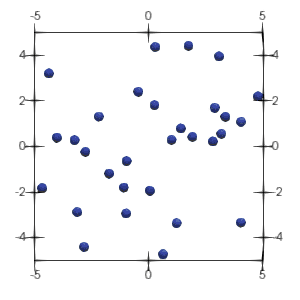

# suanPan


[](https://doi.org/10.5281/zenodo.1285221)
[](https://www.gnu.org/licenses/gpl-3.0)
[](https://suanpan-manual.readthedocs.io/?badge=latest)
[](https://github.com/TLCFEM/suanPan/releases)
[](https://hub.docker.com/r/tlcfem/suanpan/tags)
[](https://snapcraft.io/suanpan)
[](https://chocolatey.org/packages/suanpan)
[](https://chocolatey.org/packages/suanpan)
[](https://img.shields.io/github/downloads/TLCFEM/suanPan/total.svg?color=44cc11)
[](https://github.com/TLCFEM/suanPan/actions/workflows/dev-all.yml)
[](https://codecov.io/gh/TLCFEM/suanPan)
[](https://www.codacy.com/gh/TLCFEM/suanPan/dashboard?utm_source=github.com&amp;utm_medium=referral&amp;utm_content=TLCFEM/suanPan&amp;utm_campaign=Badge_Grade)
[](https://www.codefactor.io/repository/github/tlcfem/suanpan)
[](https://github.com/TLCFEM/suanPan)
[](https://github.com/TLCFEM/suanPan)
[](https://img.shields.io/github/languages/code-size/TLCFEM/suanPan.svg?color=44cc11)
[](https://github.com/TLCFEM/suanPan/issues)
[](https://gitter.im/suanPan-dev/community?utm_source=badge&utm_medium=badge&utm_campaign=pr-badge)
[](https://app.fossa.com/projects/git%2Bgithub.com%2FTLCFEM%2FsuanPan?ref=badge_shield)

[](https://www.gnu.org/licenses/gpl-3.0.en.html)

[](https://marketplace.visualstudio.com/items?itemName=tlc.suanpan)

***Check out the VS Code [extension](https://marketplace.visualstudio.com/items?itemName=tlc.suanpan) for syntax
highlighting and autocompletion.***

## Introduction

[🧮 **suanPan**](https://tlcfem.github.io/suanPan/) is a finite element method (FEM) simulation platform for
applications in fields such as solid mechanics and civil/structural/seismic engineering. The name **suanPan** (in some
places such as suffix it is also abbreviated as **suPan**) comes from the term *Suan Pan* (算盤), which
is [Chinese abacus](https://en.wikipedia.org/wiki/Suanpan). **suanPan** is written in modern high-quality C++ code and
is targeted to provide an efficient, concise, flexible and reliable FEM simulation platform.

**suanPan** is partially influenced by popular (non-)commercial FEA packages, such
as [ABAQUS UNIFIED FEA](https://www.3ds.com/products-services/simulia/products/abaqus/), [ANSYS](http://www.ansys.com/)
and [OpenSees](http://opensees.berkeley.edu/).

Please check the documentation [here](https://tlcfem.github.io/suanPan-manual/latest/) for command references. Please star ⭐ the project!

## Features

The highlights of **suanPan** are

- **suanPan** is *fast*, both memory and thread safe.
- **suanPan** is designed based on the [shared memory](https://en.wikipedia.org/wiki/Shared_memory) model and supports
  parallelism on heterogeneous architectures, for example, multithreaded CPU + optional GPU. The parallelism is
  available
  for both element state updating and global matrix assembling.
- **suanPan** is open source and easy to be extended to incorporate user-defined elements, materials, etc.
- **suanPan** separates the FEA model part from the linear algebra operation part, which significantly reduces the
  complexity and cost of development of new models.
- **suanPan** utilizes the new language features shipped with the latest standards (C++11 to C++20), such as new STL
  containers, smart pointers, and many others.
- **suanPan** supports simple visualization supported by [VTK](https://vtk.org/).

## Quick Start

Execute the application out-of-the-box in terminal on Linux using one of the following commands depending on how the
application is obtained. See details below.

```bash
# in folder bin/ for linux portable tarball
./suanPan.sh
# for linux packages and snap
suanPan
# for flatpak
flatpak run io.github.tlcfem.suanPan
```

Or on Windows,

```powershell
# in the folder containing suanPan.exe
.\suanPan.exe
```

First time users can use `overview` command to go through a quick introduction.

```text
+-----------------------------------------------------+
|   __        __            suanPan is an open source |
|  /  \      |  \              FEM framework (64-bit) |
|  \__       |__/  __   __         Betelgeuse (2.8.0) |
|     \ |  | |    |  \ |  |         by tlc @ 10fd6147 |
|  \__/ |__| |    |__X |  |       all rights reserved |
|                              10.5281/zenodo.1285221 |
+-----------------------------------------------------+
|  https://github.com/TLCFEM/suanPan                  |
|  https://tlcfem.github.io/suanPan-manual/latest     |
+-----------------------------------------------------+
|  https://gitter.im/suanPan-dev/community            |
+-----------------------------------------------------+

suanPan ~<> overview
```

Sample models are available for almost all models/commands. Please check the `Example` folder for details. Further
details can be seen [here](https://tlcfem.gitbook.io/suanpan-manual/tutorial/obtain) regarding how to run model files.

## Installation

Only the 64-bit version is compiled.
It is assumed that [**AVX2**](https://en.wikipedia.org/wiki/Advanced_Vector_Extensions) is available thus if the program
fails, please check if your CPU supports AVX2.
Alternatively, you can try the `no-avx` version.

> Check artifacts of [workflows](https://github.com/TLCFEM/suanPan/actions/workflows/dev-all.yml) for the latest binaries.

### Windows

#### Binary Package

The archives of binaries are released under [Release](https://github.com/TLCFEM/suanPan/releases) page.

1. `suanpan-win-mkl-vtk.zip` is the portable archive.
2. `suanpan-win-mkl-vtk.exe` is the installer.

#### Chocolatey

The binaries, which are compiled with Intel MKL and VTK, are available
on [Chocolatey](https://chocolatey.org/packages/suanpan), please use the following command to install the package.

1. Follow the [instructions](https://chocolatey.org/install) to install Chocolatey.

2. Use the following command to install `suanPan`.

   ```ps
   choco install suanpan
   ```

3. It is recommended to use a modern terminal such as [Windows Terminal](https://github.com/microsoft/terminal) for better output display.

The Chocolatey repo available to you may not be up-to-date.
If the latest version is not available, please try alternatives, such as portable binaries or scoop.

[](https://asciinema.org/a/491350)

#### Scoop

It is also possible to use [Scoop](https://scoop.sh/) to install the package.

1. Install [Scoop](https://scoop.sh/).

   ```ps
   Set-ExecutionPolicy RemoteSigned -scope CurrentUser
   iwr -useb get.scoop.sh | iex
   ```

2. Install `suanPan`.

   ```ps
   scoop install suanpan
   ```

### Linux

Linux users are recommended to obtain the binaries via `snap` or `flatpak`.

#### Snap

The snap supports visualisation via VTK and uses Intel MKL for linear algebra.
The edge channel is in sync with the `dev` branch.
The stable channel is in sync with the `master` branch.

[](https://snapcraft.io/suanpan)

[](https://asciinema.org/a/491330)

#### Flatpak

Flatpak is also available if preferred.
The beta channel is in sync with the `dev` branch.
The stable channel is in sync with the `master` branch.

<a href='https://flathub.org/apps/details/io.github.tlcfem.suanPan'></a>

```bash
# add repo
flatpak remote-add --if-not-exists flathub https://flathub.org/repo/flathub.flatpakrepo
# or the beta channel
# flatpak remote-add --if-not-exists flathub-beta https://flathub.org/beta-repo/flathub-beta.flatpakrepo
# install
flatpak install suanPan
# define alias
echo "alias suanpan=\"flatpak run io.github.tlcfem.suanPan\"" >> ~/.bashrc
```

### Other Platforms

Precompiled binaries are provided via CI/CD on macOS, Windows, and Ubuntu.
Please download the file from the [release](https://github.com/TLCFEM/suanPan/releases) page.

A few flavors are available:

1. `vtk` --- visualisation support is enabled, with this you can record VTK files for postprocessing, however, OpenGL
   may be missing on server systems
2. `mkl` --- linear algebra operations are offloaded to MKL, which gives the optimal performance on Intel chips
3. `openblas` --- linear algebra operations are offloaded to OpenBLAS, which may outperform MKL on AMD platforms
4. `no-avx` --- AVX2 support is disabled, useful for older CPUs which do not support AVX2 instructions

Advanced users can compile the program from source by themselves to enable GPU based solvers which require
an available [CUDA](https://docs.nvidia.com/cuda/cuda-toolkit-release-notes/) and/or MAGMA library.

Since CI/CD uses `GCC 11` (on Linux) and `Clang 13.0.1` (on macOS), it may be required to update/install
proper `libstdc++` (or `libc++`) version. The easiest way is to install the same compiler. For example, on Ubuntu 22.04,

```bash
# Ubuntu
sudo apt install gcc g++ gfortran libomp5
```

For VTK enabled versions, it may be necessary to install OpenGL.

```bash
# Ubuntu
sudo apt install libglu1-mesa-dev freeglut3-dev mesa-common-dev libglvnd-dev
```

It is also possible to compile the package via docker, check the dockerfiles under the `Script` folder, for any
questions please open an issue.

### Automation Related

#### VS Code

The VS Code extension is available [here](https://marketplace.visualstudio.com/items?itemName=tlc.suanpan).

#### Sublime Text

On Windows, a batch file named `AddAssociation.bat` is provided in the archive. It provides file associations and
prepares a proper working environment (build system, autocompletion, highlighting)
with [Sublime Text](https://www.sublimetext.com/). It also adds file associations with `.sp` and `.supan` files, please
run the `AddAssociation.bat` file with administrator privilege. [Sublime Text](https://www.sublimetext.com/)
autocompletion and syntax highlighting files are also provided. Please install Sublime Text first and execute the batch
file with the administrator privilege.

On Linux, a script file named as `suanPan.sh` is provided. By executing

```bash
./suanPan.sh --create-link
```

It adds Sublime Text autocompletion and syntax highlighting files to proper location if Sublime Text configuration
folder is found. It also adds a command alias `suanpan` to `~/.local/bin` and a desktop file
to `~/.local/share/applications`.

## Dependency

Additional libraries used in **suanPan** are listed as follows.

- [**ARPACK**](https://github.com/opencollab/arpack-ng)
- [**SPIKE**](http://www.spike-solver.org/) version 1.0
- [**FEAST**](http://www.feast-solver.org/) version 4.0
- [**SuperLU**](https://portal.nersc.gov/project/sparse/superlu/) version 6.0.1
- [**SuperLU MT**](https://portal.nersc.gov/project/sparse/superlu/) version 3.1
- [**OpenBLAS**](https://github.com/xianyi/OpenBLAS) version 0.3.25
- [**Lis**](https://www.ssisc.org/lis/) version 2.1.3
- [**TBB** Threading Building Blocks](https://github.com/oneapi-src/oneTBB) version 2021.12.0
- [**HDF5**](https://www.hdfgroup.org/solutions/hdf5/) version 1.10.6
- [**MUMPS**](https://mumps-solver.org/) version 5.7.0
- [**METIS**](http://glaros.dtc.umn.edu/gkhome/metis/metis/overview) version 5.1.0
- [**VTK**](https://vtk.org/) version 9.2.6
- [**CUDA**](https://docs.nvidia.com/cuda/cuda-toolkit-release-notes/) version 12.0
- [**MAGMA**](https://icl.utk.edu/magma/) version 2.8.0
- [**Armadillo**](http://arma.sourceforge.net/) version 12.8.2
- [**ensmallen**](https://ensmallen.org/) version 2.20.0
- [**oneMKL**](https://software.intel.com/content/www/us/en/develop/tools/oneapi/components/onemkl.html) version 2024.1.0
- [**Catch2**](https://github.com/catchorg/Catch2) version 3.5.4
- [**fmt**](https://github.com/fmtlib/fmt) version 10.2.1
- [**whereami**](https://github.com/gpakosz/whereami)
- [**exprtk**](https://github.com/ArashPartow/exprtk)
- **thread_pool** abridged version of [`thread-pool`](https://github.com/bshoshany/thread-pool)

Those libraries may depend on other libraries such as [zlib](https://zlib.net/)
and [Szip](https://support.hdfgroup.org/doc_resource/SZIP/). Additional tools may be used by **suanPan**, they are

- [**UPX** the Ultimate Packer for eXecutables](https://upx.github.io/)

## How To Compile

Please refer to the corresponding [page](https://tlcfem.github.io/suanPan-manual/latest/Basic/Compile/) in
the manual for details.

## Happy Modelling



## Licence

[](https://app.fossa.com/projects/git%2Bgithub.com%2FTLCFEM%2FsuanPan?ref=badge_large)
